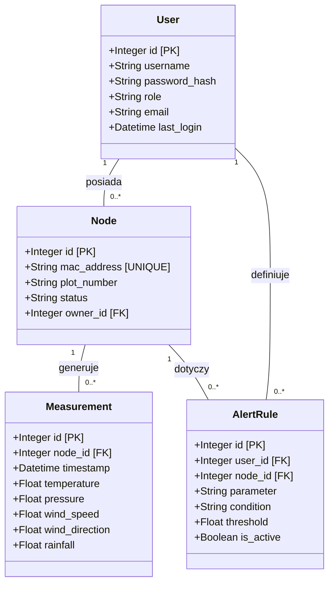

# Baza danych

Niniejszy dokument zawiera specyfikację techniczną warstwy trwałego składowania danych. Baza danych pełni rolę centralnego repozytorium informacji dla modułów Gateway, Web Backend oraz GUI.

## Wybrane technologie

1. **Silnik bazy danych:** SQLite.
   * **Uzasadnienie:** Format bezserwerowy (plikowy) eliminuje konieczność utrzymywania dodatkowych procesów systemowych, co optymalizuje zużycie zasobów na jednostce centralnej. Silnik zapewnia pełną transakcyjność (ACID), co gwarantuje integralność danych w przypadku nagłej utraty zasilania (wymaganie SEC-03).

## Komponenty systemowe

* **Plik bazy danych:** Pojedynczy plik binarny przechowujący strukturę tabel, indeksy oraz dane.
* **Interfejs SQL:** Standardowy dialekt SQL wykorzystywany do manipulacji danymi i definiowania schematu.
* **Warstwa walidacji:** Logika zaimplementowana w aplikacjach klienckich (Python), zapewniająca spójność typów danych przed zapisem.

## Wykorzystane biblioteki zewnętrzne

W zestawieniu ujęto standardowe interfejsy programistyczne wykorzystywane przez moduły systemowe do komunikacji z bazą.

| Nazwa | Autor | Zastosowanie |
| :--- | :--- | :--- |
| sqlite3 | Python Software Foundation | Biblioteka standardowa do obsługi bazy SQLite w środowisku Python. |

## Architektura oprogramowania - Diagram ERD

Poniższy diagram przedstawia relacyjną strukturę bazy danych w notacji klas UML, ilustrującą powiązania pomiędzy użytkownikami, urządzeniami a wynikami pomiarów.

## Opis struktury danych
* **User**: Przechowuje dane uwierzytelniające i uprawnienia (Admin, Manager, User). Implementuje wymagania dotyczące bezpieczeństwa i dostępu do panelu administracyjnego.
* **Node**: Rejestr fizycznych węzłów pomiarowych. Każdy rekord zawiera unikalny identyfikator sprzętowy oraz przypisanie do konkretnego właściciela (działkowicza).
* **Measurement**: Tabela historycznych odczytów. Przechowuje dane o temperaturze (WP-01), ciśnieniu (WP-02), wietrze (WP-03, WP-04) oraz opadach (WP-05).
* **AlertRule**: Definicje reguł powiadomień. Zawiera parametry graniczne oraz warunki logiczne, których spełnienie inicjuje wysyłkę ostrzeżenia e-mail (INT-05).