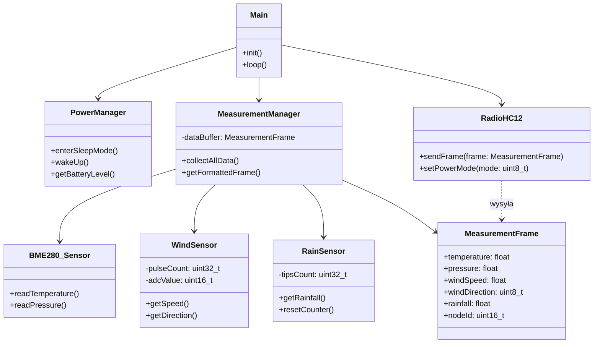

# Oprogramowanie wbudowane węzła pomiarowego

Niniejszy dokument zawiera specyfikację techniczną oprogramowania węzłów pomiarowych odpowiedzialnych za zbieranie danych środowiskowych i ich transmisję radiową.

## Wybrane technologie

1. **Mikrokontroler:** STM32L073RZT6 (seria Low-Power).
   * **Uzasadnienie:** Architektura zoptymalizowana pod kątem minimalizacji poboru prądu w trybach uśpienia, co jest kluczowe dla zasilania bateryjnego.
2. **Środowisko:** STM32CubeIDE.
3. **Warstwa abstrakcji sprzętu:** Biblioteki HAL (Hardware Abstraction Layer).
   * **Uzasadnienie:** Standaryzacja dostępu do peryferiów mikrokontrolera (I2C, UART, ADC, GPIO).

## Komponenty sprzętowe

Węzeł pomiarowy wykorzystuje następujące moduły do realizacji wymagań funkcjonalnych:

* **GY-BME280:** Cyfrowy czujnik temperatury i ciśnienia atmosferycznego. Komunikacja odbywa się za pomocą magistrali I2C.
* **SparkFun Weather Meter Kit (SEN-15901):** Zestaw czujników mechanicznych:
    * **Anemometr:** Czujnik impulsowy (kontaktron) podłączony do wejścia EXTI.
    * **Wiatrowskaz:** Układ rezystancyjny podłączony do przetwornika ADC.
    * **Deszczomierz:** Czujnik korytkowy impulsowy podłączony do wejścia EXTI.
* **HC-12 (SI4463):** Transceiver radiowy pracujący w paśmie 433 MHz. Komunikacja z mikrokontrolerem realizowana jest przez interfejs UART.

## Wykorzystane biblioteki zewnętrzne

W zestawieniu ujęto biblioteki wykorzystane do obsługi dedykowanych układów scalonych. Pozostałe komponenty są obsługiwane przez autorskie sterowniki bazujące na warstwie HAL.

| Nazwa | Autor | Zastosowanie |
| :--- | :--- | :--- |
| BME280_STM32 | Controllers Tech | Obsługa odczytu danych z czujnika BME280 przez I2C. |

## Architektura oprogramowania - Diagram Klas

Poniższy diagram przedstawia strukturę logiczną oprogramowania wbudowanego, ilustrując podział na warstwę sprzętową, sterowniki oraz logikę aplikacyjną.

## Opis struktury klas
* **Main**: Odpowiada za główną pętlę programu oraz inicjalizację wszystkich podsystemów.
* **PowerManager**: Zarządza przechodzeniem mikrokontrolera w tryby oszczędzania energii oraz wybudzaniem przez RTC.
* **MeasurementManager**: Klasa nadrzędna dla czujników, agregująca dane w obiekcie ramki pomiarowej.
* **BME280_Sensor / WindSensor / RainSensor**: Klasy sterowników niskopoziomowych bezpośrednio obsługujące peryferia (I2C, ADC, EXTI).
* **RadioHC12**: Odpowiada za konfigurację modułu radiowego i transmisję seryjną danych.
* **MeasurementFrame**: Struktura danych reprezentująca pojedynczy rekord pomiarowy przesyłany do urządzenia centralnego.