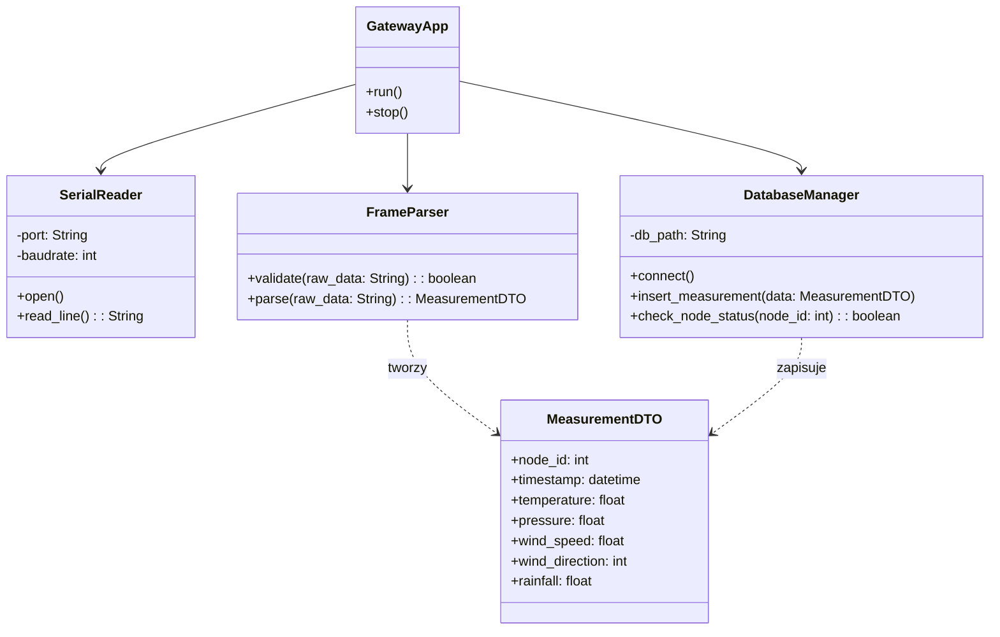

# Oprogramowanie urządzenia centralnego (Gateway)

Niniejszy dokument opisuje specyfikację techniczną aplikacji pośredniczącej (Gateway), uruchomionej na jednostce centralnej, której zadaniem jest odbiór, weryfikacja i archiwizacja danych z węzłów pomiarowych.

## Wybrane technologie

1. **Język programowania:** Python 3.
   * **Uzasadnienie:** Pełna kompatybilność z systemem operacyjnym Raspberry Pi OS oraz dostępność dojrzałych bibliotek do obsługi komunikacji szeregowej i baz danych.
2. **Silnik bazy danych:** SQLite.
   * **Uzasadnienie:** Format bezserwerowy minimalizujący narzut na zasoby procesora i pamięci RAM urządzenia centralnego przy zachowaniu pełnej transakcyjności (ACID).

## Komponenty systemowe

Oprogramowanie Gateway integruje następujące elementy sprzętowe i programowe:

* **Raspberry Pi:** Platforma obliczeniowa pełniącą rolę serwera lokalnego i bramy sieciowej.
* **Odbiornik HC-12 (SI4463):** Moduł radiowy podłączony do pinów GPIO (UART) Raspberry Pi, skonfigurowany do pracy w trybie transparentnym.
* **Sterownik szeregowy:** Moduł programowy odpowiedzialny za asynchroniczny odczyt bufora UART.
* **Parser danych:** Komponent odpowiedzialny za dekompozycję surowych ramek bajtowych na sformatowane obiekty danych pomiarowych.

## Wykorzystane biblioteki zewnętrzne

W zestawieniu ujęto biblioteki niezbędne do komunikacji sprzętowej oraz obsługi bazy danych.

| Nazwa | Autor | Zastosowanie |
| :--- | :--- | :--- |
| pyserial | Chris Liechti | Obsługa dwukierunkowej komunikacji przez port szeregowy UART. |
| sqlite3 | Python Software Foundation | Interfejs programistyczny do obsługi bazy danych SQL. |

## Architektura oprogramowania - Diagram Klas

Diagram przedstawia strukturę modułów logicznych aplikacji Gateway oraz ich powiązania z bazą danych i warstwą sprzętową.

## Opis struktury klas

* **GatewayApp**: Główna klasa zarządzająca cyklem życia aplikacji. Inicjalizuje połączenia i zawiera pętlę zdarzeń odpowiedzialną za przepływ danych między komponentami.
* **SerialReader**: Odpowiada za niskopoziomową komunikację z modułem HC-12. Realizuje odczyt strumienia danych z portu /dev/ttyS0 lub /dev/ttyAMA0.
* **FrameParser**: Implementuje logikę wyodrębniania danych z ramek tekstowych lub binarnych. Wykonuje sumy kontrolne i walidację poprawności danych przed ich przekazaniem do bazy.
* **DatabaseManager**: Hermetyzuje zapytania SQL. Odpowiada za otwieranie połączenia, wykonywanie transakcji INSERT oraz weryfikację uprawnień węzłów w tabeli urządzeń.
* **MeasurementDTO (Data Transfer Object)**: Struktura danych reprezentująca znormalizowany rekord pomiarowy, używana do przesyłania informacji wewnątrz aplikacji.