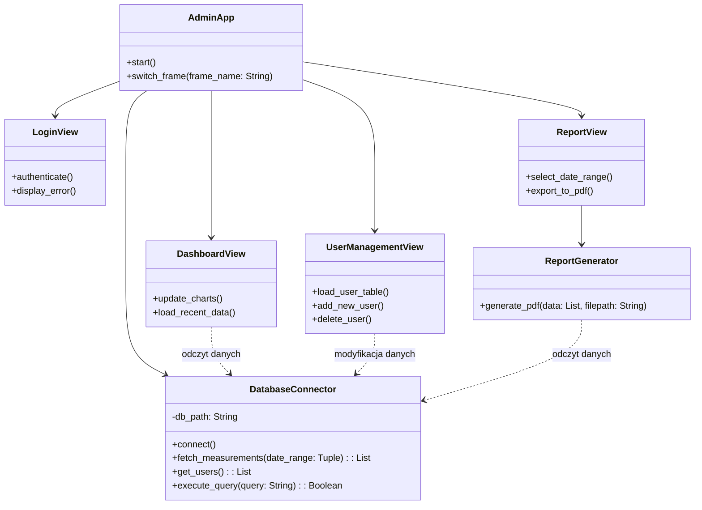

# Oprogramowanie aplikacji okienkowej (GUI)

Niniejszy dokument opisuje architekturę oraz specyfikację techniczną aplikacji okienkowej przeznaczonej dla zarządcy systemu. Aplikacja umożliwia bezpośredni dostęp do bazy danych w celu przeglądania wyników pomiarów, zarządzania kontami użytkowników oraz generowania raportów.

## Wybrane technologie

1. **Język programowania:** Python 3.
   * **Uzasadnienie:** Umożliwia szybką budowę interfejsów graficznych i natywną integrację z bazą SQLite. Spójność z technologią wybraną dla urządzenia centralnego (Gateway) pozwala na współdzielenie logiki uwierzytelniania i modeli danych.
2. **Biblioteka GUI:** CustomTkinter.
   * **Uzasadnienie:** Narzędzie to stanowi rozszerzenie standardowej biblioteki Tkinter, umożliwiając implementację nowoczesnych interfejsów graficznych. Oferuje sprzętowe wsparcie dla skalowania DPI oraz natywną obsługę motywów, co eliminuje problemy z czytelnością na ekranach o wysokiej rozdzielczości.

## Wykorzystane biblioteki zewnętrzne

W zestawieniu ujęto biblioteki konieczne do poprawnego renderowania interfejsu oraz realizacji kluczowych funkcji biznesowych określonych w wymaganiach.

| Nazwa | Autor | Zastosowanie |
| :--- | :--- | :--- |
| customtkinter | Tom Schimansky | Renderowanie struktury interfejsu graficznego i nowoczesnych komponentów wizualnych. |
| sqlite3 | Python Software Foundation | Realizacja bezpośrednich zapytań SQL do pliku bazy danych. |
| reportlab | ReportLab Inc. | Generowanie raportów okresowych i formatowanie ich do plików wyjściowych PDF. |

## Architektura oprogramowania - Diagram Klas

Poniższy diagram prezentuje logiczny podział aplikacji okienkowej na warstwę widoku (GUI) oraz warstwę obsługi danych (logika biznesowa).

## Opis struktury klas
* **AdminApp**: Główny kontroler aplikacji. Odpowiada za inicjalizację głównego okna oraz zarządzanie stanem nawigacji pomiędzy poszczególnymi panelami.
* **DatabaseConnector**: Klasa hermetyzująca komunikację z bazą SQLite. Zapewnia bezpieczne metody wykonywania zapytań SQL dla innych komponentów systemu, izolując warstwę interfejsu od mechanizmów składowania danych.
* **LoginView**: Panel logowania realizujący wymaganie SEC-01. Zabezpiecza dostęp do aplikacji przed nieautoryzowanymi użytkownikami.
* **DashboardView**: Główny panel roboczy wyświetlający aktualne dane pomiarowe z węzłów w postaci czytelnych zestawień i wykresów.
* **ReportView & ReportGenerator**: Klasy implementujące funkcję tworzenia raportów. ReportView obsługuje parametry wejściowe od zarządcy (zakres dat, wybrane węzły), a ReportGenerator agreguje odpowiednie rekordy i kompiluje plik wyjściowy.
* **UserManagementView**: Panel dedykowany do zarządzania dostępem. Pozwala na tworzenie nowych kont działkowiczów oraz przypisywanie im odpowiednich numerów działek.