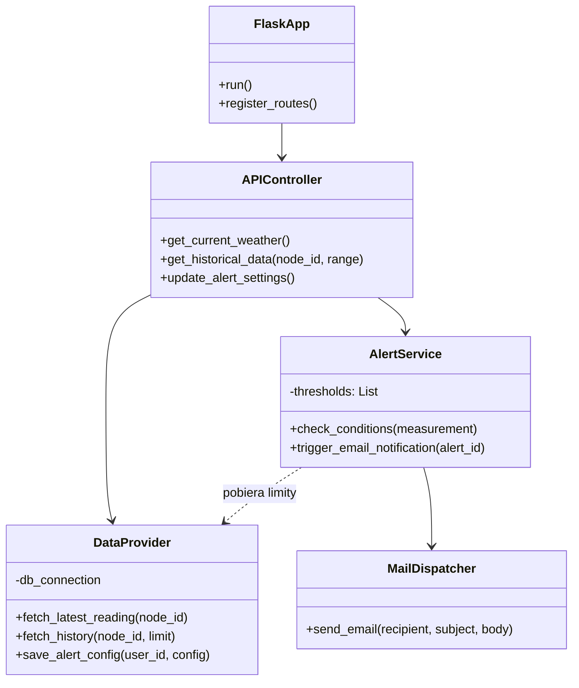

# Backend aplikacji webowej

Niniejszy dokument opisuje architekturę oraz specyfikację techniczną warstwy serwerowej aplikacji webowej. Backend pełni rolę pośrednika między bazą danych SQLite a frontendem użytkownika, realizując logikę biznesową oraz udostępniając interfejs API.

## Wybrane technologie

1. **Język programowania:** Python 3.
   * **Uzasadnienie:** Zapewnia spójność z pozostałymi modułami systemu (Gateway, GUI). Bogaty ekosystem bibliotek pozwala na efektywną obsługę baz danych oraz protokołów sieciowych.
2. **Framework webowy:** Flask.
   * **Uzasadnienie:** Flask jest mikro-frameworkiem, który minimalizuje narzut systemowy, co jest istotne przy uruchamianiu aplikacji na urządzeniach o ograniczonych zasobach, takich jak Raspberry Pi. Zapewnia elastyczność w doborze komponentów i łatwą integrację z systemem szablonów Jinja2.

## Komponenty systemowe

Backend integruje następujące moduły logiczne:

* **Serwer Aplikacji:** Instancja Flaska obsługująca cykl życia żądań HTTP i zarządzająca routingiem.
* **API REST:** Zestaw punktów końcowych (endpoints) zwracających dane w formacie JSON na potrzeby wykresów Chart.js.
* **Moduł Powiadomień (Alert Engine):** Komponent odpowiedzialny za weryfikację warunków brzegowych pomiarów i wysyłkę powiadomień e-mail.
* **Warstwa Dostępu do Danych (DAO):** Interfejs komunikacyjny z bazą danych SQLite zapewniający separację logiki SQL od logiki aplikacyjnej.

## Wykorzystane biblioteki zewnętrzne

W zestawieniu ujęto biblioteki niezbędne do realizacji wymagań funkcjonalnych, takich jak dostęp przez WWW (INT-01) oraz ostrzeganie o zmianie warunków (INT-05).

| Nazwa | Autor | Zastosowanie |
| :--- | :--- | :--- |
| Flask | Pallets Projects | Obsługa routingu HTTP i renderowanie szablonów Jinja2. |
| Flask-Mail | Dan Jacob | Obsługa protokołu SMTP do wysyłania powiadomień e-mail. |
| sqlite3 | Python Software Foundation | Realizacja zapytań do bazy danych w celu pobrania historii pomiarów. |

## Architektura oprogramowania - Diagram Klas

Diagram przedstawia strukturę backendu oraz relacje między warstwą API, usługami a bazą danych.

## Opis struktury klas
* **FlaskApp**: Klasa bazowa konfigurująca środowisko serwera, parametry sieciowe oraz inicjalizująca rozszerzenia (np. obsługę poczty).
* **APIController**: Realizuje mapowanie żądań URL na konkretne działania. Odpowiada za zwracanie danych niezbędnych dla interfejsu Działkowicza oraz Zarządcy.
* **DataProvider**: Odpowiada za izolację zapytań SQL. Pobiera dane o temperaturze, ciśnieniu, wietrze i opadach wymagane przez specyfikację funkcjonalną.
* **AlertService**: Implementuje wymaganie INT-05. Po każdym odczycie sprawdza, czy wartości nie przekraczają zdefiniowanych przez użytkownika progów.
* **MailDispatcher**: Niskopoziomowy moduł komunikacji z serwerem SMTP, realizujący fizyczną wysyłkę wiadomości do użytkowników.