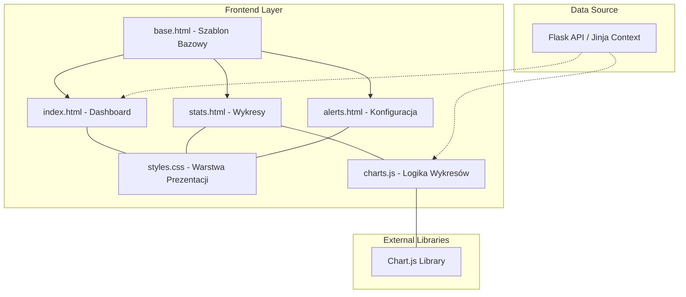

# Frontend aplikacji webowej

Niniejszy dokument przedstawia specyfikację techniczną warstwy prezentacji systemu monitorowania pogody. Frontend jest odpowiedzialny za interakcję z użytkownikiem końcowym (Działkowiczem) oraz prezentację danych gromadzonych przez jednostkę centralną w sposób graficzny i tekstowy.

## Wybrane technologie

1. **System szablonów:** Jinja2.
   * **Uzasadnienie:** Integracja z frameworkiem Flask pozwala na sprawne generowanie dynamicznej zawartości HTML po stronie serwera. Wykorzystanie dziedziczenia szablonów zapewnia spójność interfejsu oraz ułatwia modyfikację wspólnych elementów nawigacyjnych.
2. **Wizualizacja danych:** Chart.js.
   * **Uzasadnienie:** Lekka biblioteka JavaScript renderująca wykresy w elemencie HTML5 Canvas. Umożliwia płynną prezentację przebiegów czasowych temperatury, ciśnienia oraz opadów bezpośrednio w przeglądarce użytkownika bez nadmiernego obciążania procesora.
3. **Stylowanie i układ:** HTML5 oraz CSS3.
   * **Uzasadnienie:** Zastosowanie responsywnych arkuszy stylów pozwala na poprawną ekspozycję danych zarówno na ekranach komputerów stacjonarnych, jak i urządzeń mobilnych.

## Komponenty interfejsu

Warstwa frontendu składa się z następujących modułów funkcjonalnych:

* **Dashboard (Panel Główny):** Prezentacja aktualnych parametrów pogodowych w czasie rzeczywistym dla konkretnej działki.
* **Moduł Wykresów:** Interaktywne wykresy prezentujące historyczne trendy pomiarowe pobierane asynchronicznie z API backendu.
* **Panel Konfiguracji Alertów:** Interfejs umożliwiający użytkownikowi definiowanie progów alarmowych dla powiadomień e-mail.
* **Widok Zbiorczy:** Prezentacja uśrednionych danych z całego obiektu ROD dla celów statystycznych.

## Wykorzystane biblioteki zewnętrzne

| Nazwa | Autor | Zastosowanie |
| :--- | :--- | :--- |
| Chart.js | Chart.js Contributors | Generowanie wykresów liniowych i słupkowych danych pogodowych. |
| Jinja2 | Pallets Projects | Renderowanie dynamicznych widoków HTML i wstrzykiwanie danych z backendu. |

## Architektura frontendu - Diagram Komponentów

Poniższy diagram ilustruje strukturę plików frontendu oraz sposób przepływu danych pomiędzy szablonami a bibliotekami zewnętrznymi.

## Opis struktury i wymagań jakościowych
* **base.html**: Zawiera strukturę główną strony, nagłówki oraz skrypty ładowane na każdej podstronie, co zapewnia optymalizację kodu.
* **Wydajność (PERF-01)**: Optymalizacja skryptów JavaScript i minimalizacja liczby zapytań do API ma na celu zapewnienie czasu odpowiedzi strony poniżej 2 sekund.
* **Dostępność (REL-01)**: Interfejs jest hostowany bezpośrednio na urządzeniu centralnym i musi zachować dostępność na poziomie minimum 95% w skali miesiąca.
* **Integracja**: Dane z bazy SQLite są przekazywane do szablonów Jinja w momencie żądania (odczyt statyczny) lub pobierane przez skrypty Chart.js za pomocą asynchronicznych zapytań do punktów końcowych API (odczyt dynamiczny).